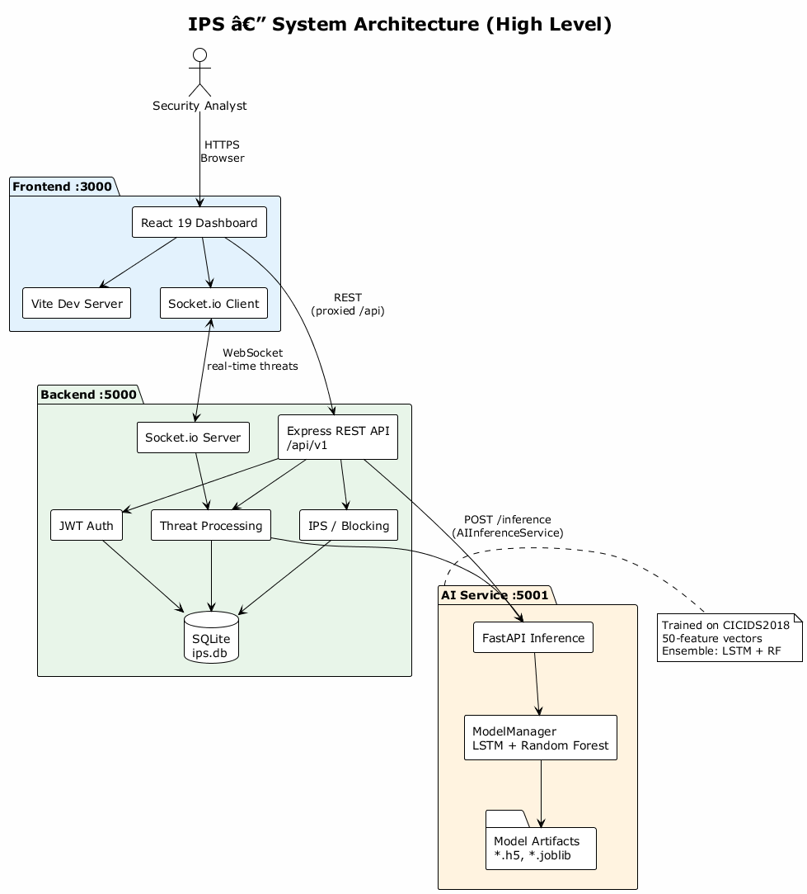
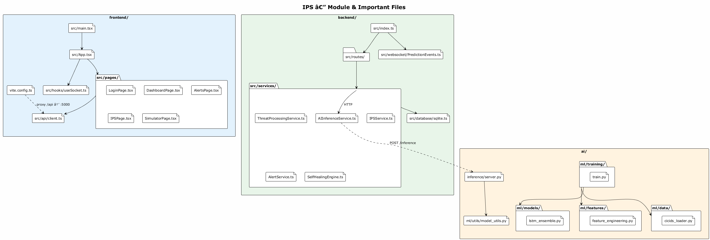
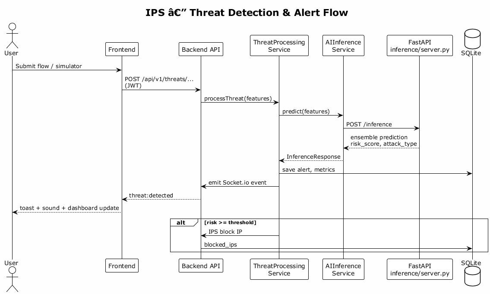

# IPS — نظام منع التسلل المدعوم بالذكاء الاصطناعي

[](https://github.com/redtubbypo/IPS)

[English (README.md)](README.md) | **العربية**

منصة أمنية متكاملة تكتشف التهديدات الشبكية باستخدام تعلم الآلة (مجموعة LSTM + غابة عشوائية على ميزات CICIDS2018)، تحظر حركة المرور الضارة، وتعرض التنبيهات في الوقت الفعلي عبر لوحة تحكم React.

---

## فهرس المحتويات

1. [البنية المعمارية](#البنية-المعمارية)
2. [التقنيات المستخدمة](#التقنيات-المستخدمة)
3. [هيكل المستودع](#هيكل-المستودع)
4. [شرح الوحدات](#شرح-الوحدات)
5. [أهم ملفات الكود](#أهم-ملفات-الكود)
6. [المتطلبات](#المتطلبات)
7. [تشغيل المشروع بالكامل](#تشغيل-المشروع-بالكامل)
8. [تدريب نماذج التعلم الآلي](#تدريب-نماذج-التعلم-الآلي)
9. [نظرة على واجهات API](#نظرة-على-واجهات-api)
10. [Docker](#docker)
11. [الترخيص ومجموعة البيانات](#الترخيص-ومجموعة-البيانات)

---

## البنية المعمارية

### نظرة عامة على النظام



| الطبقة | المنفذ | الدور |
|--------|--------|-------|
| **الواجهة الأمامية** | 3000 | لوحة React: تسجيل دخول، تنبيهات، IPS، محاكي تهديدات |
| **الخادم الخلفي** | 5000 | REST (`/api/v1`)، JWT، SQLite، Socket.io للأحداث الفورية |
| **خدمة الذكاء الاصطناعي** | 5001 | FastAPI — استدلال LSTM + غابة عشوائية |

مسار البيانات: **المتصفح → الخلفية → خدمة AI** للتنبؤات؛ **الخلفية → SQLite** للتخزين؛ **الخلفية ↔ الواجهة** عبر WebSocket للتنبيهات الحية.

### تفكيك الوحدات



### تسلسل اكتشاف التهديد



مصادر PlantUML (قابلة للتعديل): [`docs/architecture-system.puml`](docs/architecture-system.puml)، [`docs/architecture-modules.puml`](docs/architecture-modules.puml)، [`docs/sequence-threat-detection.puml`](docs/sequence-threat-detection.puml).

إعادة توليد صور PNG:

```bash
cd docs
java -jar plantuml.jar -tpng *.puml
```

---

## التقنيات المستخدمة

| المجال | الأدوات والمكتبات |
|--------|-------------------|
| **الواجهة الأمامية** | React 19، TypeScript، Vite 5، Tailwind CSS 3.4، Recharts، Socket.io-client، Lucide |
| **الخادم الخلفي** | Node.js 18+، Express 4، Socket.io 4، TypeScript 5، SQLite3، JWT، bcryptjs، Axios، Winston، Helmet، Zod/Joi |
| **الذكاء الاصطناعي / ML** | Python 3.10، FastAPI، Uvicorn، NumPy، TensorFlow/Keras (تدريب)، scikit-learn/joblib، imbalanced-learn (SMOTE)، pandas |
| **DevOps** | Docker، Docker Compose (AI + الخلفية) |
| **مجموعة البيانات** | [CICIDS2018](https://www.unb.ca/cic/datasets/ids-2018.html) |

---

## هيكل المستودع

```
IPS/
├── ai/                    # تدريب Python + استدلال FastAPI
│   ├── inference/server.py
│   ├── ml/
│   ├── models/            # نماذج مدربة (غير مضمنة إذا كانت كبيرة)
│   ├── data/              # CSV — تحميل منفصل
│   └── Dockerfile
├── backend/               # Node.js API + WebSocket
├── frontend/              # لوحة React
├── docs/                  # PlantUML + صور PNG
├── docker-compose.yml
├── README.md
└── README.ar.md
```

---

## شرح الوحدات

### 1. وحدة الذكاء الاصطناعي (`ai/`)

| المكوّن | المسار | الوصف |
|---------|--------|--------|
| **واجهة الاستدلال** | `ai/inference/server.py` | FastAPI: `/health`، `/inference`، `/models`، `/status` |
| **مدير النماذج** | `ai/ml/utils/model_utils.py` | تحميل LSTM وغابة عشوائية وملف التطبيع JSON |
| **مجموعة LSTM** | `ai/ml/models/lstm_ensemble.py` | بنية Keras + Random Forest |
| **هندسة الميزات** | `ai/ml/features/feature_engineering.py` | متجه 50 بُعداً |
| **محمّل البيانات** | `ai/ml/data/cicids_loader.py` | CICIDS2018 + SMOTE |
| **خط التدريب** | `ai/ml/training/train.py` | تدريب كامل → `ai/models/` |

**فئات الهجوم (مثال):** Benign، DoS، DDoS، PortScan، Botnet.

### 2. الوحدة الخلفية (`backend/`)

| المكوّن | المسار | الوصف |
|---------|--------|--------|
| **نقطة الدخول** | `backend/src/index.ts` | Express، المسارات، Socket.io، SQLite |
| **عميل AI** | `backend/src/services/AIInferenceService.ts` | HTTP إلى `AI_SERVICE_URL` |
| **معالجة التهديدات** | `backend/src/services/ThreatProcessingService.ts` | استدلال + تنبيهات + IPS |
| **منع التسلل** | `backend/src/services/IPSService.ts` | عناوين IP المحظورة والقواعد |
| **التنبيهات** | `backend/src/services/AlertService.ts` | إدارة التنبيهات |
| **الإصلاح الذاتي** | `backend/src/services/SelfHealingEngine.ts` | إجراءات تلقائية |
| **كشف الانحراف** | `backend/src/services/DriftDetectionService.ts` | مراقبة انحراف النموذج/البيانات |
| **WebSocket** | `backend/src/websocket/PredictionEvents.ts` | أحداث التنبؤ الفورية |
| **قاعدة البيانات** | `backend/src/database/sqlite.ts` | `backend/data/ips.db` |

**مسارات REST** (`/api/v1`): `auth`، `ips`، `alerts`، `network`، `dashboard`، `config`، `threats`.

### 3. الواجهة الأمامية (`frontend/`)

| الصفحة | المسار | الوصف |
|--------|--------|--------|
| تسجيل الدخول | `frontend/src/pages/LoginPage.tsx` | مصادقة JWT |
| لوحة التحكم | `frontend/src/pages/DashboardPage.tsx` | مقاييس ورسوم بيانية |
| التنبيهات | `frontend/src/pages/AlertsPage.tsx` | قائمة التنبيهات |
| IPS | `frontend/src/pages/IPSPage.tsx` | التحكم في الحظر |
| المحاكي | `frontend/src/pages/SimulatorPage.tsx` | تهديدات تجريبية |
| عميل API | `frontend/src/api/client.ts` | طلبات REST مع التوكن |
| WebSocket | `frontend/src/hooks/useSocket.ts` | أحداث التهديد الحية |
| التطبيق | `frontend/src/App.tsx` | التوجيه، التوست، الصوت |

**الوكيل في التطوير:** `vite.config.ts` يوجّه `/api` إلى المنفذ 5000.

---

## أهم ملفات الكود

| الملف | الأهمية |
|------|---------|
| `ai/inference/server.py` | نقطة دخول الاستدلال في الإنتاج |
| `ai/ml/training/train.py` | تدريب النماذج قبل النشر |
| `ai/ml/utils/model_utils.py` | تحميل وتنبؤ مشترك |
| `backend/src/index.ts` | ربط كل المسارات والأمان |
| `backend/src/services/AIInferenceService.ts` | جسر Node ↔ Python |
| `backend/src/services/ThreatProcessingService.ts` | منطق معالجة التهديدات |
| `backend/src/database/sqlite.ts` | المخطط وتهيئة SQLite |
| `frontend/src/App.tsx` | تجربة المستخدم والتنبيهات الفورية |
| `frontend/src/hooks/useSocket.ts` | تحديثات اللوحة الحية |
| `docker-compose.yml` | تشغيل AI + الخلفية في حاويات |

---

## المتطلبات

- **Node.js** ≥ 18 و **npm** ≥ 9  
- **Python** 3.10+  
- **Java** 8+ (لإعادة توليد مخططات PlantUML فقط)  
- **Git**  
- اختياري: **Docker** و **Docker Compose**  
- للتدريب: ملفات **CICIDS2018** في `ai/data/MachineLearningCVE/`

---

## تشغيل المشروع بالكامل

شغّل الخدمات الثلاث في **ثلاث نوافذ طرفية**.

### الخطوة 0 — الاستنساخ

```bash
git clone https://github.com/redtubbypo/IPS.git
cd IPS
```

### الخطوة 1 — خدمة الذكاء الاصطناعي (منفذ 5001)

```bash
cd ai
python -m venv venv
venv\Scripts\activate          # Windows
# source venv/bin/activate     # Linux/macOS

pip install -r requirements.txt
# pip install tensorflow joblib scikit-learn

python -m uvicorn inference.server:app --host 0.0.0.0 --port 5001 --reload
```

تحقق: http://localhost:5001/health

### الخطوة 2 — الخادم الخلفي (منفذ 5000)

```bash
cd backend
npm install
copy .env.example .env
npm run dev
```

تحقق: http://localhost:5000/health

متغيرات البيئة (`backend/.env.example`):

- `AI_SERVICE_URL=http://localhost:5001`
- `CORS_ORIGIN=http://localhost:3000`
- `JWT_SECRET` — غيّره في الإنتاج

قاعدة SQLite تُنشأ تلقائياً في `backend/data/ips.db`.

### الخطوة 3 — الواجهة الأمامية (منفذ 3000)

```bash
cd frontend
npm install
npm run dev
```

افتح: http://localhost:3000

### قائمة فحص سريعة

| الخدمة | الرابط |
|--------|--------|
| الواجهة | http://localhost:3000 |
| صحة الخلفية | http://localhost:5000/health |
| صحة AI | http://localhost:5001/health |

### سكربت PowerShell (اختياري)

```powershell
.\test-threat.ps1
```

---

## تدريب نماذج التعلم الآلي

1. حمّل ملفات CICIDS2018 إلى `ai/data/MachineLearningCVE/`.
2. ثبّت حزم التدريب:

```bash
pip install tensorflow pandas scikit-learn joblib imbalanced-learn
```

3. نفّذ التدريب:

```bash
cd ai
python -m ml.training.train
```

4. تأكد من وجود الملفات في `ai/models/`:

- `lstm_ensemble_*.h5`
- `random_forest_*.joblib`
- `normalization_*.json`

أعد تشغيل خدمة AI بعد التدريب.

---

## نظرة على واجهات API

### خدمة AI (`http://localhost:5001`)

| الطريقة | المسار | الوصف |
|---------|--------|--------|
| GET | `/health` | جاهزية الخدمة والنماذج |
| POST | `/inference` | `{ "features": [50 float], "flow_id": "..." }` |
| GET | `/models` | بيانات النماذج المحمّلة |
| GET | `/status` | مقاييس التشغيل |

### الخلفية (`http://localhost:5000/api/v1`)

| البادئة | الغرض |
|---------|--------|
| `/auth` | تسجيل الدخول و JWT |
| `/threats` | إرسال / محاكاة تهديدات |
| `/alerts` | تنبيهات الأمان |
| `/ips` | عناوين محظورة وقواعد IPS |
| `/dashboard` | مقاييس مجمّعة |
| `/network` | عقد الشبكة |
| `/config` | إعدادات النظام |

المسارات المحمية تحتاج: `Authorization: Bearer <token>`.

---

## Docker

```bash
docker compose up --build
```

ثم في طرفية أخرى:

```bash
cd frontend
npm install
npm run dev
```

مجلد `ai/models` يُركّب للقراءة فقط داخل حاوية AI.

---

## الترخيص ومجموعة البيانات

- كود التطبيق: راجع ترخيص المستودع.
- **CICIDS2018** يخضع لشروط مزوّد البيانات؛ للبحث والتعليم ما لم يُسمح باستخدامه في الإنتاج.

---

## المساهمة

1. Fork [redtubbypo/IPS](https://github.com/redtubbypo/IPS)  
2. أنشئ فرع ميزة  
3. افتح Pull Request مع وصف وخطة اختبار  

للتوثيق بالإنجليزية راجع [README.md](README.md).
